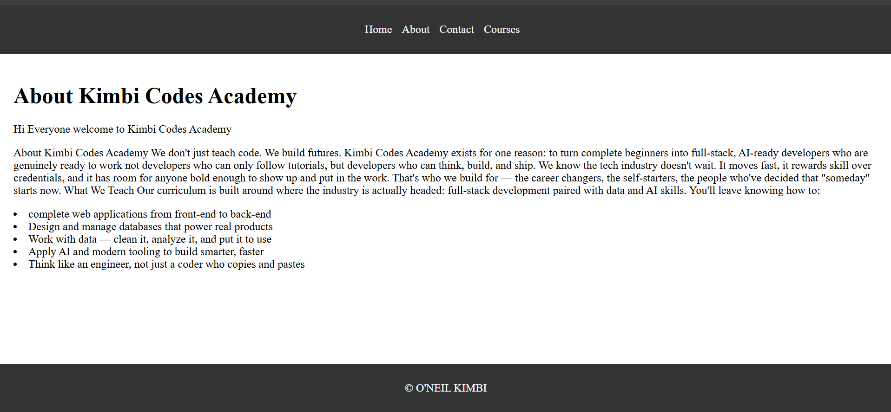

# Go Web Application

This is a simple website written in Golang. It uses the `net/http` package to serve HTTP requests.

## Running the server

To run the server, execute the following command:

```bash
sudo apt  install golang-go
```
> Build the application
```bash
go build -o main .
```
> Use the next command to verify if a binary called main was build
```bash
ls
```
> Execute the main binary
```bash
./main
```

<!-- ```bash
go run main.go
``` -->

The server will start on port 8080. You can access it by navigating to `http://localhost:8080/courses` in your web browser.

## Looks like this



---
## Having issues installing go in ubuntu? follow the steps beloow
> Remove the half-installed apt attempt first (optional but cleaner)
```bash
sudo apt remove golang-go golang-1.22-go golang-1.22-src golang-src 2>/dev/null
```
```bash
cd /tmp
```
```bash
wget https://go.dev/dl/go1.26.5.linux-amd64.tar.gz
```
```bash
sudo rm -rf /usr/local/go
```
```bash
sudo tar -C /usr/local -xzf go1.26.5.linux-amd64.tar.gz
```
> Add to PATH (put this in ~/.bashrc so it persists)
```bash
echo 'export PATH=$PATH:/usr/local/go/bin' >> ~/.bashrc
```
```bash
source ~/.bashrc
```
```bash
go version
```
> should print go1.26.
---