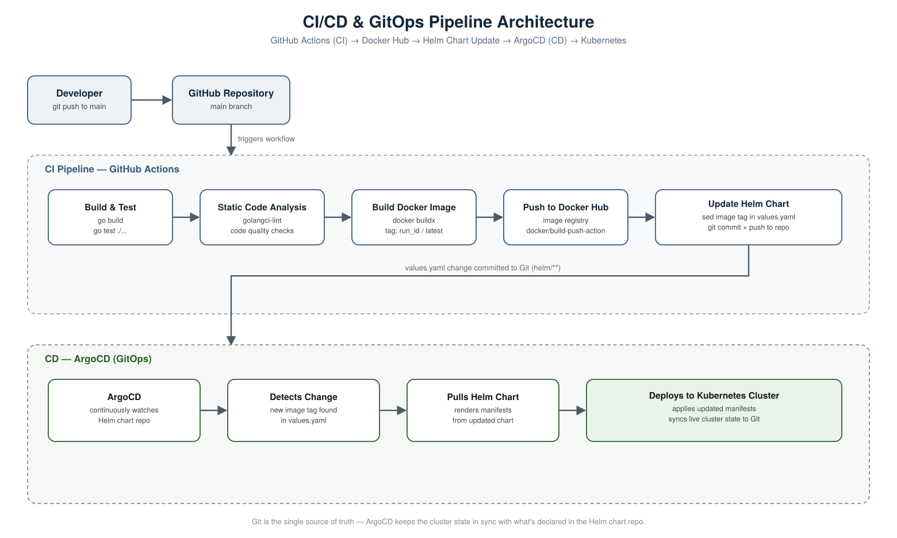

# CI/CD & GitOps Pipeline

This project implements a full CI/CD pipeline using **GitHub Actions** for continuous integration, and **ArgoCD** for GitOps-based continuous delivery to Kubernetes.



## How It Works

### 1. Developer pushes code
A developer commits and pushes code to the **main branch** of the GitHub repository. This push is the trigger for the entire pipeline.

### 2. GitHub Actions workflow kicks off (CI)
The push automatically triggers a GitHub Actions workflow, which runs the following steps in order:

1. **Build & Test** — compiles the application and runs the test suite to catch issues early.
2. **Static Code Analysis** — runs a linter (e.g. `golangci-lint`) to catch code quality issues and enforce coding standards.
3. **Build Docker Image** — builds a Docker image of the application using Docker Buildx.
4. **Push to Docker Hub** — pushes the newly built image to Docker Hub, tagged with a unique identifier (e.g. the GitHub Actions run ID) so every build is traceable.
5. **Update Helm Chart** — updates the `values.yaml` file in the Helm chart with the new image tag, then commits and pushes that change back to the repository.

At this point, CI is done. The new image exists in Docker Hub, and the desired state (which image version should be running) has been declared in Git via the updated Helm chart.

### 3. ArgoCD takes over (CD / GitOps)
ArgoCD continuously watches the Helm chart repository for changes. Once it detects that `values.yaml` has been updated with a new image tag, it automatically:

1. **Pulls the updated Helm chart**
2. **Renders the Kubernetes manifests** from the chart
3. **Deploys the new version to the Kubernetes cluster**, syncing the live cluster state to match what's declared in Git

## Why This Approach

- **Separation of concerns** — GitHub Actions handles build/test/package; ArgoCD handles deployment. Each does one job well.
- **Git as the single source of truth** — the desired state of the cluster always lives in Git (the Helm chart), not in manual `kubectl` commands or ad-hoc scripts.
- **Auditability** — every deployment traces back to a specific commit, image tag, and pipeline run.
- **Self-healing** — since ArgoCD continuously reconciles the cluster against Git, any manual/out-of-band changes to the cluster get automatically corrected back to the declared state.
- **No manual deployment steps** — once code is merged to main, everything from build to production deployment happens automatically.

## Pipeline Summary

```
Developer → git push (main) → GitHub Actions
                                   │
                    ┌──────────────┼───────────────┬───────────────────┐
                    ▼              ▼                ▼                   ▼
              Build & Test   Static Analysis   Build & Push Image   Update Helm values.yaml
                                                  (Docker Hub)         (commit + push)
                                                                            │
                                                                            ▼
                                                                  ArgoCD detects change
                                                                            │
                                                                            ▼
                                                                  Pulls Helm chart
                                                                            │
                                                                            ▼
                                                              Deploys to Kubernetes Cluster
```